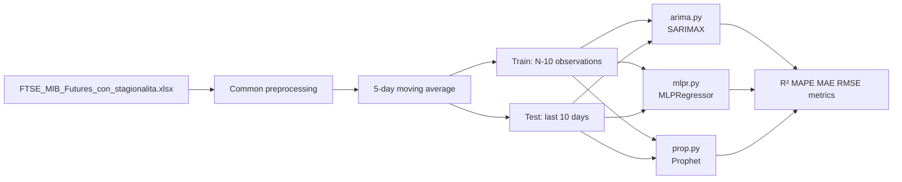

# Forecast FTSE MIB Futures

Analysis and forecasting project for **FTSE MIB Futures** closing prices, built on three complementary approaches:

| Script | Approach | Main library |
|--------|----------|--------------|
| `arima.py` | Classical ARIMA models | statsmodels (SARIMAX) |
| `mlpr.py` | MLP neural network with feature engineering | scikit-learn (MLPRegressor) |
| `prop.py` | Additive decomposition with regressors | Prophet (Facebook/Meta) |

All three scripts share the same dataset, target series, and out-of-sample validation scheme.

---

## Dataset

**File:** `FTSE_MIB_Futures_con_stagionalita.xlsx`

| Property | Value |
|----------|-------|
| Observations | 1,276 |
| Period | 26/09/2019 – 27/09/2024 |
| Frequency | Business days |

**Main columns:**

- **Prices:** `closed`, `open`, `high`, `low`
- **Volume:** `vol.`
- **Changes:** `closed_var`, `open_var`, `high_var`, `low_var`, `vol_var`
- **Seasonality:** `month`, `day_month`, `day_week`
- **Other:** `fluctuation`, `date`

The target variable is `closed` (closing price).

---

## Common preprocessing

All scripts apply the same initial transformations:

1. Load the Excel file and index by date
2. Clean the series (`closed`): remove `inf` and missing values
3. **Smoothing** with a 5-period moving average (`serie_ma`)
4. **Strict back-test:** train on the full series except the **last 10 business days**, used as the out-of-sample test set

---

## Requirements

```bash
pip install pandas numpy matplotlib scipy scikit-learn statsmodels openpyxl prophet
```

| Package | Purpose |
|---------|---------|
| `pandas`, `openpyxl` | Excel I/O and time series manipulation |
| `numpy`, `scipy` | Numerical computation and statistical tests |
| `matplotlib` | Plots and output figures |
| `scikit-learn` | Metrics, scaling, MLPRegressor (`mlpr.py`) |
| `statsmodels` | SARIMAX, ACF/PACF (`arima.py`) |
| `prophet` | Prophet models (`prop.py`) |

> **Note:** Prophet requires `cmdstan` or `pystan` for fitting. On macOS/Linux, `pip install prophet` usually handles the installation automatically.

---

## Running the scripts

Run each script from the project directory (where the Excel file is located):

```bash
python arima.py
python mlpr.py
python prop.py
```

Scripts generate PNG plots in the current directory (and, for `mlpr.py`, in the `neural_network_results/` subfolder). Console output also includes printed metrics.

---

## `arima.py` — ARIMA models

### Goal

Identify and estimate ARIMA models on the smoothed series, with exploratory ACF/PACF analysis and a comparison of two candidate specifications.

### Pipeline

1. **Exploratory analysis**
   - Descriptive statistics (original series vs MA5)
   - Historical series plots and moving average comparison
   - ACF/PACF on the differenced series (`d=1`)

2. **Estimated models** (both with linear drift `trend=[0,1,0,0]`)

   | Model | Specification |
   |-------|---------------|
   | Model 1 | ARIMA([1,3], 1, 0) — selective AR at lags 1 and 3 |
   | Model 2 | ARIMA(0, 1, 4) — MA(4) for comparison |

3. **Diagnostics**
   - Residual analysis (time series, histogram, Q-Q plot, ACF)
   - 10-step forecasts with confidence intervals

4. **Metrics**
   - R², MAPE, MAE, RMSE on **Train**, **Test**, and **Full**
   - Best model selected by test-set R²

### Main outputs

| File | Content |
|------|---------|
| `serie_originale.png` | Historical closing price series |
| `serie_vs_media_mobile5.png` | Original series vs MA5 |
| `acf_pacf_serie_ma5.png` | Autocorrelation functions |
| `residual_analysis_modello1.png` | Residual diagnostics — Model 1 |
| `residual_analysis_modello2.png` | Residual diagnostics — Model 2 |
| `confronto_metriche_train_test.png` | Metrics comparison — Model 1 |
| `focus_training_test_modello1.png` | Zoom on training tail + test — Model 1 |
| `focus_test_forecast.png` | Forecast comparison of both models on test set |
| `arima_full_dataset_predictions.png` | Predictions over the full dataset |

---

## `mlpr.py` — MLP neural network

### Goal

Forecast the smoothed price with an **MLPRegressor** (scikit-learn), systematically testing combinations of dataset features and technical indicators.

### Architecture

- **Sequences:** `N_STEPS = 4` (4 past observations → forecast of the 5th step)
- **Network:** 2 hidden layers `(64, 32)` for quick tests; `(128, 64, 32)` for final models
- **Training:** Adam, early stopping, L2 (`alpha=0.001`), 15% internal validation split
- **Scaling:** StandardScaler or MinMaxScaler on features and target

### Feature engineering

**Technical indicators** (`calculate_technical_features` function):

- Momentum and ROC
- Simple and exponential moving averages (SMA, EMA)
- Rolling volatility
- RSI, MACD, Bollinger Bands, Stochastic
- Lagged values and price position within range

**Dataset features** (Excel columns):

- Single variables: `closed_var`, `month`, `low_var`, `high`, `low`, `day_week`, `open`
- Combinations of 2 to 5 variables (e.g. `closed_var + month + low_var`)

### Pipeline

1. Test all combinations in `FEATURE_COMBINATIONS`
2. Filter: keep only models with **test R² > 0**
3. Select and fully train the **top 6** models
4. Final comparison with plots and CSV export

### Main outputs

All results are saved under `neural_network_results/`:

| File / folder | Content |
|---------------|---------|
| `top6_models_comparison.csv` | Comparative metrics table |
| `top6_models_comparison.png` | Top 6 comparison chart |
| `top6_models_predictions_comparison.png` | Side-by-side predictions |
| `modello_<name>/` | Per model: train/test/full plots, metrics, training history |

---

## `prop.py` — Facebook Prophet

### Goal

Model the smoothed series with **Prophet**, incorporating yearly seasonality and exogenous regressors based on price momentum.

### Educational figures (Section 2.1)

Before fitting, the script generates 5 illustrative figures on Prophet fundamentals:

- Additive architecture: `y = g(t) + s(t) + h(t) + ε`
- Piecewise linear trend with changepoints
- Fourier seasonality
- Exogenous regressors
- Effect of `seasonality_prior_scale`

### Estimated models

| Model | Seasonality | `seasonality_prior_scale` | Regressors |
|-------|-------------|---------------------------|------------|
| Model 1 | Yearly only | 0.1 | momentum 1, 3, 5, 10 |
| Model 2 | Yearly only | 0.15 | momentum 3, 10 |

Shared configuration: `daily_seasonality=False`, `weekly_seasonality=False`, `seasonality_mode='additive'`.

### Pipeline

1. Compute and align momentum regressors
2. Fit Prophet on train, predict on test
3. Train / Test / Full metrics (R², MAPE, MAE, RMSE)
4. Residual analysis, component decomposition, test-set focus plots
5. Select the best model and produce final visualization

### Main outputs

| File | Content |
|------|---------|
| `prophet_2_1_1_additive_decomposition.png` | Additive decomposition (educational) |
| `prophet_2_1_2_trend_piecewise_linear.png` | Piecewise trend |
| `prophet_2_1_3_seasonal_fourier.png` | Fourier seasonality |
| `prophet_2_1_4_regressori_esogeni.png` | Exogenous regressors |
| `prophet_2_1_5_seasonality_prior_scale.png` | Seasonality prior scale |
| `prophet_momentum_regressors.png` | Momentum regressor series |
| `prophet_decomposition.png` | Best model decomposition |
| `prophet_residual_analysis_modello1.png` | Residuals — Model 1 |
| `prophet_residual_analysis_modello2.png` | Residuals — Model 2 |
| `prophet_confronto_metriche_mod1.png` | Metrics — Model 1 |
| `prophet_focus_test_forecast.png` | Test-set forecast zoom |
| `prophet_final_best_model.png` | Best model visualization |

---

## Approach comparison



| Aspect | ARIMA | MLP | Prophet |
|--------|-------|-----|---------|
| Interpretability | High (AR/MA coefficients) | Low (black box) | Medium (decomposed components) |
| External features | No (univariate series only) | Yes (dataset + technical indicators) | Yes (momentum regressors) |
| Seasonality | Not modeled explicitly | Via features (`month`, etc.) | Yearly Fourier |
| Output | Analytical confidence intervals | No native intervals | `yhat_lower` / `yhat_upper` intervals |

---

## Project structure

```
forecast ftse/
├── FTSE_MIB_Futures_con_stagionalita.xlsx   # Dataset
├── arima.py                                  # ARIMA analysis
├── mlpr.py                                   # MLP neural network
├── prop.py                                   # Prophet
├── neural_network_results/                   # mlpr.py output (generated)
└── README.md
```

---

## Methodological notes

- The **5-day moving average** reduces high-frequency noise and makes the series more stationary for modeling.
- The **10-observation test set** is intentionally small: it evaluates very short-term predictive ability under strict conditions.
- Metrics are computed at three levels: **Train** (in-sample fit), **Test** (10 out-of-sample days), **Full** (entire series).
- `mlpr.py` automatically discards feature combinations with test R² ≤ 0 to avoid models worse than the mean baseline.
