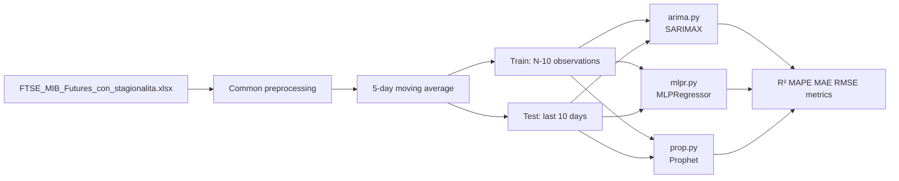

# Forecast FTSE MIB Futures

Analysis and forecasting project for **FTSE MIB Futures** closing prices, built on three complementary approaches:

| Script | Approach | Main library |
|--------|----------|--------------|
| `arima.py` | Classical ARIMA models | statsmodels (SARIMAX) |
| `mlpr.py` | MLP neural network with feature engineering | scikit-learn (MLPRegressor) |
| `prop.py` | Additive decomposition with regressors | Prophet (Facebook/Meta) |

All three scripts share the same dataset, target series, and out-of-sample validation scheme.

---

## Dataset

**File:** `FTSE_MIB_Futures_con_stagionalita.xlsx`

| Property | Value |
|----------|-------|
| Observations | 1,276 |
| Period | 26/09/2019 – 27/09/2024 |
| Frequency | Business days |

**Main columns:**

- **Prices:** `closed`, `open`, `high`, `low`
- **Volume:** `vol.`
- **Changes:** `closed_var`, `open_var`, `high_var`, `low_var`, `vol_var`
- **Seasonality:** `month`, `day_month`, `day_week`
- **Other:** `fluctuation`, `date`

The target variable is `closed` (closing price).

---

## Common preprocessing

All scripts apply the same initial transformations:

1. Load the Excel file and index by date
2. Clean the series (`closed`): remove `inf` and missing values
3. **Smoothing** with a 5-period moving average (`serie_ma`)
4. **Strict back-test:** train on the full series except the **last 10 business days**, used as the out-of-sample test set

---

## Requirements

```bash
pip install pandas numpy matplotlib scipy scikit-learn statsmodels openpyxl prophet
```

| Package | Purpose |
|---------|---------|
| `pandas`, `openpyxl` | Excel I/O and time series manipulation |
| `numpy`, `scipy` | Numerical computation and statistical tests |
| `matplotlib` | Plots and output figures |
| `scikit-learn` | Metrics, scaling, MLPRegressor (`mlpr.py`) |
| `statsmodels` | SARIMAX, ACF/PACF (`arima.py`) |
| `prophet` | Prophet models (`prop.py`) |

> **Note:** Prophet requires `cmdstan` or `pystan` for fitting. On macOS/Linux, `pip install prophet` usually handles the installation automatically.

---

## Running the scripts

Run each script from the project directory (where the Excel file is located):

```bash
python arima.py
python mlpr.py
python prop.py
```

Scripts generate PNG plots in the current directory (and, for `mlpr.py`, in the `neural_network_results/` subfolder). Console output also includes printed metrics.

---

## `arima.py` — ARIMA models

### Goal

Identify and estimate ARIMA models on the smoothed series, with exploratory ACF/PACF analysis and a comparison of two candidate specifications.

### Pipeline

1. **Exploratory analysis**
   - Descriptive statistics (original series vs MA5)
   - Historical series plots and moving average comparison
   - ACF/PACF on the differenced series (`d=1`)

2. **Estimated models** (both with linear drift `trend=[0,1,0,0]`)

   | Model | Specification |
   |-------|---------------|
   | Model 1 | ARIMA([1,3], 1, 0) — selective AR at lags 1 and 3 |
   | Model 2 | ARIMA(0, 1, 4) — MA(4) for comparison |

3. **Diagnostics**
   - Residual analysis (time series, histogram, Q-Q plot, ACF)
   - 10-step forecasts with confidence intervals

4. **Metrics**
   - R², MAPE, MAE, RMSE on **Train**, **Test**, and **Full**
   - Best model selected by test-set R²

### Main outputs

| File | Content |
|------|---------|
| `serie_originale.png` | Historical closing price series |
| `serie_vs_media_mobile5.png` | Original series vs MA5 |
| `acf_pacf_serie_ma5.png` | Autocorrelation functions |
| `residual_analysis_modello1.png` | Residual diagnostics — Model 1 |
| `residual_analysis_modello2.png` | Residual diagnostics — Model 2 |
| `confronto_metriche_train_test.png` | Metrics comparison — Model 1 |
| `focus_training_test_modello1.png` | Zoom on training tail + test — Model 1 |
| `focus_test_forecast.png` | Forecast comparison of both models on test set |
| `arima_full_dataset_predictions.png` | Predictions over the full dataset |

---

## `mlpr.py` — MLP neural network

### Goal

Forecast the smoothed price with an **MLPRegressor** (scikit-learn), systematically testing combinations of dataset features and technical indicators.

### Architecture

- **Sequences:** `N_STEPS = 4` (4 past observations → forecast of the 5th step)
- **Network:** 2 hidden layers `(64, 32)` for quick tests; `(128, 64, 32)` for final models
- **Training:** Adam, early stopping, L2 (`alpha=0.001`), 15% internal validation split
- **Scaling:** StandardScaler or MinMaxScaler on features and target

### Feature engineering

**Technical indicators** (`calculate_technical_features` function):

- Momentum and ROC
- Simple and exponential moving averages (SMA, EMA)
- Rolling volatility
- RSI, MACD, Bollinger Bands, Stochastic
- Lagged values and price position within range

**Dataset features** (Excel columns):

- Single variables: `closed_var`, `month`, `low_var`, `high`, `low`, `day_week`, `open`
- Combinations of 2 to 5 variables (e.g. `closed_var + month + low_var`)

### Pipeline

1. Test all combinations in `FEATURE_COMBINATIONS`
2. Filter: keep only models with **test R² > 0**
3. Select and fully train the **top 6** models
4. Final comparison with plots and CSV export

### Main outputs

All results are saved under `neural_network_results/`:

| File / folder | Content |
|---------------|---------|
| `top6_models_comparison.csv` | Comparative metrics table |
| `top6_models_comparison.png` | Top 6 comparison chart |
| `top6_models_predictions_comparison.png` | Side-by-side predictions |
| `modello_<name>/` | Per model: train/test/full plots, metrics, training history |

---

## `prop.py` — Facebook Prophet

### Goal

Model the smoothed series with **Prophet**, incorporating yearly seasonality and exogenous regressors based on price momentum.

### Educational figures (Section 2.1)

Before fitting, the script generates 5 illustrative figures on Prophet fundamentals:

- Additive architecture: `y = g(t) + s(t) + h(t) + ε`
- Piecewise linear trend with changepoints
- Fourier seasonality
- Exogenous regressors
- Effect of `seasonality_prior_scale`

### Estimated models

| Model | Seasonality | `seasonality_prior_scale` | Regressors |
|-------|-------------|---------------------------|------------|
| Model 1 | Yearly only | 0.1 | momentum 1, 3, 5, 10 |
| Model 2 | Yearly only | 0.15 | momentum 3, 10 |

Shared configuration: `daily_seasonality=False`, `weekly_seasonality=False`, `seasonality_mode='additive'`.

### Pipeline

1. Compute and align momentum regressors
2. Fit Prophet on train, predict on test
3. Train / Test / Full metrics (R², MAPE, MAE, RMSE)
4. Residual analysis, component decomposition, test-set focus plots
5. Select the best model and produce final visualization

### Main outputs

| File | Content |
|------|---------|
| `prophet_2_1_1_additive_decomposition.png` | Additive decomposition (educational) |
| `prophet_2_1_2_trend_piecewise_linear.png` | Piecewise trend |
| `prophet_2_1_3_seasonal_fourier.png` | Fourier seasonality |
| `prophet_2_1_4_regressori_esogeni.png` | Exogenous regressors |
| `prophet_2_1_5_seasonality_prior_scale.png` | Seasonality prior scale |
| `prophet_momentum_regressors.png` | Momentum regressor series |
| `prophet_decomposition.png` | Best model decomposition |
| `prophet_residual_analysis_modello1.png` | Residuals — Model 1 |
| `prophet_residual_analysis_modello2.png` | Residuals — Model 2 |
| `prophet_confronto_metriche_mod1.png` | Metrics — Model 1 |
| `prophet_focus_test_forecast.png` | Test-set forecast zoom |
| `prophet_final_best_model.png` | Best model visualization |

---

## Results

All models were evaluated on the same setup: **MA5-smoothed series**, **1,262 training observations**, **10 out-of-sample test days** (16–27 September 2024). Metrics are reported on **Train**, **Test**, and **Full** (entire series).

### Best model per approach (test set)

| Rank | Script | Model | Key features | R² Test | MAPE Test | MAE Test | RMSE Test |
|------|--------|-------|--------------|---------|-----------|----------|-----------|
| 1 | `mlpr.py` | `dataset_single_low` | `low` + price sequence | **0.8442** | **0.16%** | **54.99** | **66.52** |
| 2 | `arima.py` | ARIMA([1,3],1,0) + linear drift | Univariate (MA5) | 0.8018 | 0.16% | 55.21 | 75.02 |
| 3 | `prop.py` | Yearly seasonality + momentum 1,3,5,10 | `seasonality_prior_scale=0.1` | 0.3318 | 0.35% | 118.17 | 137.76 |

**Overall winner:** the MLP with the `low` price as an exogenous feature achieves the highest test R² (0.8442) and the lowest MAE/RMSE. ARIMA Model 1 is a close second with nearly identical MAPE (0.16%) and only slightly higher error. Prophet models underperform on the test set despite strong in-sample fit.

### Cross-approach comparison (best models)

| Metric | ARIMA ([1,3],1,0) | MLP (`dataset_single_low`) | Prophet (Model 1) |
|--------|-------------------|----------------------------|-------------------|
| **R² Train** | 0.9801 | 0.9992 | 0.9834 |
| **R² Test** | 0.8018 | **0.8442** | 0.3318 |
| **R² Full** | 0.9807 | 0.9992 | 0.9839 |
| **MAPE Train** | 0.33% | 0.38% | 1.78% |
| **MAPE Test** | **0.16%** | **0.16%** | 0.35% |
| **MAPE Full** | 0.33% | 0.38% | 1.77% |
| **MAE Test** | 55.21 | **54.99** | 118.17 |
| **RMSE Test** | 75.02 | **66.52** | 137.76 |

> **Interpretation:** All three approaches fit the training data well (R² > 0.98), but generalization on the 10-day test window differs sharply. ARIMA and MLP maintain R² > 0.80 on test data; Prophet drops to R² ≈ 0.33, suggesting overfitting or mismatch between yearly seasonality and the short test horizon.

---

### `arima.py` — detailed results

Both models use linear drift `trend=[0,1,0,0]` on the MA5 series.

| Metric | Model 1: ARIMA([1,3],1,0) | Model 2: ARIMA(0,1,4) |
|--------|---------------------------|------------------------|
| R² Train | 0.9801 | 0.9802 |
| R² Test | **0.8018** | 0.4283 |
| R² Full | 0.9807 | 0.9808 |
| MAPE Train | 0.33% | 0.27% |
| MAPE Test | **0.16%** | 0.31% |
| MAPE Full | 0.33% | 0.27% |
| MAE Test | **55.21** | 105.61 |
| RMSE Test | **75.02** | 127.41 |

**Selected model:** ARIMA([1,3],1,0) with selective AR terms at lags 1 and 3. The MA(4) alternative (Model 2) nearly halves test R², confirming that the AR structure better captures short-term dynamics on this series.

**Sample test forecasts (Model 1):**

| Date | Predicted | Actual | Error |
|------|-----------|--------|-------|
| 2024-09-16 | 33,498.21 | 33,425.60 | −72.61 |
| 2024-09-20 | 33,720.29 | 33,792.00 | +71.71 |
| 2024-09-27 | 33,855.66 | 34,046.00 | +190.34 |

---

### `prop.py` — detailed results

| Metric | Model 1 (momentum 1,3,5,10; prior 0.1) | Model 2 (momentum 3,10; prior 0.15) |
|--------|----------------------------------------|--------------------------------------|
| R² Train | **0.9834** | 0.9824 |
| R² Test | **0.3318** | 0.2626 |
| R² Full | **0.9839** | 0.9829 |
| MAPE Train | **1.78%** | 1.83% |
| MAPE Test | 0.35% | **0.35%** |
| MAE Test | 118.17 | **117.91** |
| RMSE Test | **137.76** | 144.71 |

**Selected model:** Model 1 (yearly seasonality + four momentum regressors). Adding more momentum terms improves test R² marginally over Model 2, but both Prophet specifications lag far behind ARIMA and MLP on out-of-sample R².

**Sample test forecasts (Model 1):**

| Date | Predicted | Actual | Error (%) |
|------|-----------|--------|-----------|
| 2024-09-16 | 33,632.38 | 33,425.60 | −0.62% |
| 2024-09-19 | 33,704.00 | 33,740.40 | +0.11% |
| 2024-09-27 | 33,958.48 | 34,046.00 | +0.26% |

---

### `mlpr.py` — detailed results

**Feature screening:** 24 combinations tested; **17 valid** (test R² > 0), **7 discarded** (test R² ≤ 0, including `dataset_single_month` with R² = −2.28).

**Top 6 models (full training):**

| Rank | Model | Features | R² Train | R² Test | MAPE Test | MAE Test | N Features |
|------|-------|----------|----------|---------|-----------|----------|------------|
| 1 | `dataset_single_low` | `low` | 0.9992 | **0.8442** | **0.16%** | **54.99** | 2 |
| 2 | `baseline` | price only | 0.9990 | 0.8307 | 0.16% | 55.33 | 1 |
| 3 | `dataset_single_high` | `high` | 0.9990 | 0.7886 | 0.17% | 57.51 | 2 |
| 4 | `dataset_2vars_5` | `closed_var`, `low` | 0.9987 | 0.7755 | 0.22% | 72.78 | 3 |
| 5 | `dataset_single_open` | `open` | 0.9991 | 0.7017 | 0.21% | 69.69 | 2 |
| 6 | `dataset_single_day_week` | `day_week` | 0.9961 | 0.6417 | 0.24% | 82.02 | 2 |

**Selected model:** `dataset_single_low` — the daily **low** price, combined with a 4-step price sequence (`N_STEPS=4`), yields the best test performance. OHLC-related features (`low`, `high`, `open`) consistently outperform variation-based (`closed_var`) or calendar features alone.

**Discarded combinations (test R² ≤ 0):** `dataset_single_month`, `dataset_2vars_1`, `dataset_2vars_3`, `dataset_2vars_6`, `dataset_3vars_1`, `dataset_3vars_2`, `dataset_3vars_4`.

---

### Summary ranking (test R²)

```
1. MLP    — dataset_single_low          R² = 0.8442   MAPE = 0.16%
2. MLP    — baseline (price only)       R² = 0.8307   MAPE = 0.16%
3. ARIMA  — ARIMA([1,3],1,0)           R² = 0.8018   MAPE = 0.16%
4. MLP    — dataset_single_high         R² = 0.7886   MAPE = 0.17%
5. ARIMA  — ARIMA(0,1,4)               R² = 0.4283   MAPE = 0.31%
6. Prophet — Model 1                    R² = 0.3318   MAPE = 0.35%
7. Prophet — Model 2                    R² = 0.2626   MAPE = 0.35%
```

**Key takeaways:**

- **Short-term forecasting (10 business days):** MLP and ARIMA are the strongest; both achieve ~0.16% MAPE on the test set.
- **Exogenous information helps:** adding `low` to the MLP improves test R² from 0.83 (baseline) to 0.84; Prophet momentum regressors do not provide the same benefit.
- **Prophet trade-off:** excellent in-sample fit (R² ≈ 0.98) but weaker out-of-sample generalization on this short horizon.
- **Model complexity:** simpler ARIMA([1,3],1,0) beats the more flexible MA(4) specification; among MLPs, single-feature models often outperform multi-feature combinations.

---

## Approach comparison



| Aspect | ARIMA | MLP | Prophet |
|--------|-------|-----|---------|
| Interpretability | High (AR/MA coefficients) | Low (black box) | Medium (decomposed components) |
| External features | No (univariate series only) | Yes (dataset + technical indicators) | Yes (momentum regressors) |
| Seasonality | Not modeled explicitly | Via features (`month`, etc.) | Yearly Fourier |
| Output | Analytical confidence intervals | No native intervals | `yhat_lower` / `yhat_upper` intervals |

---

## Project structure

```
forecast ftse/
├── FTSE_MIB_Futures_con_stagionalita.xlsx   # Dataset
├── arima.py                                  # ARIMA analysis
├── mlpr.py                                   # MLP neural network
├── prop.py                                   # Prophet
├── neural_network_results/                   # mlpr.py output (generated)
└── README.md
```

---

## Methodological notes

- The **5-day moving average** reduces high-frequency noise and makes the series more stationary for modeling.
- The **10-observation test set** is intentionally small: it evaluates very short-term predictive ability under strict conditions.
- Metrics are computed at three levels: **Train** (in-sample fit), **Test** (10 out-of-sample days), **Full** (entire series).
- `mlpr.py` automatically discards feature combinations with test R² ≤ 0 to avoid models worse than the mean baseline.
